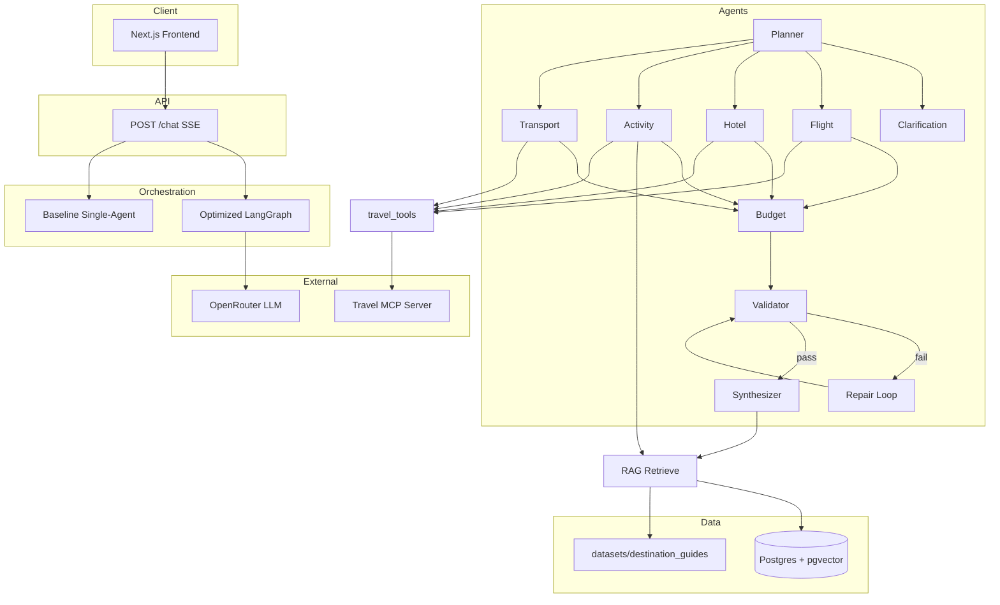

# TravelAI — Multi-Agent Travel Planner

Production-grade capstone travel planning system: multi-agent LangGraph orchestration, MCP tools, RAG over destination guides, and a reproducible evaluation harness.

---

## Business & Use Case

**Problem:** Generic LLM chat gives unstructured travel advice, weak budget enforcement, and can imply confirmed bookings.

**Solution:** TravelAI produces **day-by-day itineraries with line-item cost estimates**. All outputs are **estimate only — not a booking**. When destination, budget, or duration is missing, the system asks for clarification instead of inventing a full plan.

**Users:** Self-planners comparing destinations and budgets; capstone eval uses a fixed golden set to measure quality objectively.

---

## Capstone §2.1 — Components (4 of 6)

Eval (§2.2) is separate and does **not** count toward the six.

| Component | Used | Role in TravelAI | Key files |
|-----------|:----:|------------------|-----------|
| **Multi-agent** | ✅ | LangGraph orchestration: Planner routing, 8 specialists, validator, repair loop | `backend/app/graph/workflow.py`, `backend/app/agents/` |
| **Tools** | ✅ | Mock travel APIs + optional Tavily web search; read-only estimates | `backend/app/services/travel_tools.py`, `backend/app/services/tavily_search.py` |
| **RAG** | ✅ | Destination guides → embed → pgvector → Activity / Synthesizer | `backend/app/rag/retriever.py`, `datasets/destination_guides/` |
| **MCP** | ✅ | Standalone MCP server exposing the same read-only tools | `backend/app/mcp/server.py` |
| Memory | ❌ | No Mem0/Letta cross-session memory (request-scoped `AgentState` only) | — |
| Security / Governance | ❌ | No dedicated policy engine; product uses estimate-only tools + validator | `backend/app/observability/agent_run_logger.py` (optional run logs) |

---

## System Architecture



### Data flow (optimized path)

1. **Planner** parses user message → `TravelBrief` (destination, days, budget, interests).
2. Missing required fields → **Clarification** (no specialists run).
3. Complete brief → **Flight / Hotel / Activity / Transport** (Activity: RAG → optional Tavily → mock).
4. **Budget** aggregates costs → **Validator** checks structure, budget, duplicates.
5. On failure → **Repair** (scale costs, max 2 rounds) → re-validate.
6. **Synthesizer** merges LLM itinerary + structured data → `TravelPlanResponse`.

### Baseline vs optimized (eval modes)

| Mode | Module | Behavior |
|------|--------|----------|
| **R0 baseline** | `backend/app/graph/baseline.py` | Single pass, mock tools, no RAG / validator / repair |
| **R1** | `backend/app/graph/workflow.py` → `run_r1_graph` | Specialists + budget; no RAG / validator / repair |
| **R2** | `backend/app/graph/workflow.py` → `run_r2_graph` | R1 + RAG; no validator / repair |
| **R3 optimized** | `backend/app/graph/workflow.py` → `run_optimized_graph` | Full pipeline |

Full design notes: [docs/architecture.md](docs/architecture.md)

### Agents

| Agent | Responsibility |
|-------|----------------|
| Planner | Extract brief, set `agents_to_run` |
| Clarification | Ask when destination / budget / duration missing |
| Flight / Hotel / Activity / Transport | Specialist estimates |
| Budget | Totals and within-budget flag |
| Validator | Rule checks + optional LLM enrichment |
| Repair | Scale costs when over budget |
| Synthesizer | Final day-by-day itinerary |

---

## Capstone §2.2 — Evaluation

| Item | Detail |
|------|--------|
| Golden set | **28 cases** — `eval/golden.jsonl` (`expected_facts`, `forbidden_facts`, tags) |
| Harness | `eval/run_eval.py` — `--mode baseline \| r1 \| r2 \| optimized \| all \| summary` |
| Metrics | Rule pass, budget satisfaction, day structure, interest match, forbidden violations, latency, cost, RAGAS (heuristic) |
| Dual judge | Rule-based rater A + OpenRouter LLM rater B — `eval/judge.py` |
| κ target | ≥ **0.6** — `eval/results/kappa.json` |
| Unit tests | **24** tests — `tests/unit/` |

```bash
cd backend
pip install -r requirements.txt
pytest ../tests/unit -v

PYTHONPATH=. .venv/bin/python ../eval/run_eval.py --mode baseline
PYTHONPATH=. .venv/bin/python ../eval/run_eval.py --mode r1
PYTHONPATH=. .venv/bin/python ../eval/run_eval.py --mode r2
PYTHONPATH=. .venv/bin/python ../eval/run_eval.py --mode optimized
PYTHONPATH=. .venv/bin/python ../eval/run_eval.py --mode all       # R0→R3 + iteration.md
PYTHONPATH=. .venv/bin/python ../eval/run_eval.py --mode summary   # no API calls
```

Archived draft results: `eval/results/archive/draft_2026-05-30/`

---

## Capstone §2.3 — Experiment

**Requirement 1 — Baseline → Optimize:** R0 vs R3 on the same 28-case golden set.

**Requirement 2 — 0 → 1 → N rounds:** each round adds one capability; **metric delta vs previous round** is logged after ablation eval.

Run ablation (separate or `--mode all`), then `--mode summary` to refresh tables:

| Output | Path |
|--------|------|
| Iteration log (R0→R3, Δ vs prev) | [`eval/results/iteration.md`](eval/results/iteration.md) |
| R0 vs R3 summary | [`eval/results/summary.md`](eval/results/summary.md) |
| Per-round JSON | `baseline_results.json`, `r1_results.json`, `r2_results.json`, `optimized_results.json` |

## Experiment Results

| Round | Change | Metric delta (vs previous) | Conclusion |
|-------|--------|----------------------------|------------|
| R0 | Baseline: single-agent, no RAG/validator/repair | rule pass 60.7% (— vs prev); RAG cases 0/28; interest 68.5% (—); budget 86.4% (—); latency p50 2622ms | Starting point: fast, minimal constraints |
| R1 | + specialist agents + budget (no RAG/validator/repair) | rule pass 60.7% (+0.0pp vs prev); interest 85.7% (+17.3pp); budget 63.6% (-22.7pp); latency p50 44784ms | Specialists add structure; rule pass +0.0pp vs R0 |
| R2 | + RAG grounding (no validator/repair) | rule pass 64.3% (+3.6pp vs prev); RAG cases 0→20/28; interest 82.1% (-3.6pp); budget 63.6% (+0.0pp); latency p50 49788ms | RAG grounding on 20/28 cases; interest/budget vs R1 |
| R3 | + validator + repair loop | rule pass 82.1% (+17.9pp vs prev); RAG cases 20→18/28; interest 75.0% (-7.1pp); budget 94.7% (+31.1pp); latency p50 50556ms | Validator+repair; best rule pass +17.9pp vs R2 (trade: latency/cost) |

## Capstone §2.4 — Analysis

### Results & conclusions

On **28 golden cases**, optimized (R3) improves **rule pass rate by +21.4pp** (60.7% → 82.1%), **budget satisfaction by +8.4pp**, and **interest match by +6.5pp**, while reducing **forbidden-fact violations** from 25.0% to 17.9%. Optimized runs **RAG retrieval on 18/28 cases** (baseline: 0). Dual-judge **κ = 0.704** meets the ≥ 0.6 target with full OpenRouter judge coverage. The experiment supports the thesis that multi-agent orchestration with RAG and validation measurably improves plan quality at the cost of latency and per-case LLM spend.

### Failure analysis (optimized, rule judge — pick 3 for presentation)

| Case | Why it failed | Fix / status |
|------|---------------|--------------|
| **`japan_transport_focus`** | Missing transport plan; expected 6-day itinerary not met | Transport specialist output not always surfaced in final plan; edge case for validator |
| **`paris_art_culture`** | Missing budget summary; insufficient cultural activities | Synthesizer should always attach `budget_summary`; partial LLM merge gap |
| **`london_5day_international`** | Missing flight estimate in output | Flight agent ran but estimate not in final response for this prompt shape |
| `over_budget_probe` | Intentionally over-budget probe | Expected stress test; repair loop reduces but does not always pass |
| `london_transport_hotel` | Transport/hotel facts not satisfied | Specialist merge + brief parsing edge case |

Additional failures and tags: [`eval/results/summary.md`](eval/results/summary.md#failure-analysis-rule-judge-optimized)

**Eval note:** On `barcelona_style_reject`, synthesizer LLM returned malformed JSON → graceful fallback to deterministic itinerary (`backend/app/services/synthesizer_service.py`).

### Trade-off (one line)

> **Optimized trades ~50s eval latency and ~$0.009/case for +21pp rule pass and RAG grounding on 18/28 cases; baseline is faster and cheaper but fails constraints on 39% of cases.**

---

## Quick Start

```bash
cd travelai
cp backend/.env.example backend/.env
# Set OPENROUTER_API_KEY (LLM_PROVIDER=openrouter)

docker compose up -d postgres redis
docker compose up backend

# Frontend (separate terminal)
cd frontend && npm install && npm run dev
```

- API: http://localhost:8000 · Docs: http://localhost:8000/docs · Frontend: http://localhost:3000

### Example request

```bash
curl -N -X POST http://localhost:8000/chat \
  -H "Content-Type: application/json" \
  -H "Accept: text/event-stream" \
  -d '{
    "conversation_id": "00000000-0000-0000-0000-000000000001",
    "session_id": "00000000-0000-0000-0000-000000000002",
    "message": "Plan a 5-day Japan trip under $2500. I like food, nature, and culture.",
    "departure_city": "San Francisco"
  }'
```

### MCP server (optional)

```bash
cd backend
python -m app.mcp.server
# or: docker compose --profile mcp run mcp
```

---

## Project Structure

```
travelai/
├── frontend/                 # Next.js UI
├── backend/
│   ├── app/
│   │   ├── agents/           # 8 agents + repair
│   │   ├── graph/            # baseline.py + workflow.py
│   │   ├── rag/              # retriever, embeddings
│   │   ├── mcp/              # MCP server
│   │   ├── services/         # LLM, tools, synthesizer
│   │   └── api/chat.py       # SSE endpoint
├── datasets/
│   ├── destination_guides/   # RAG source docs
│   └── mock/                 # mock JSON data
├── eval/
│   ├── golden.jsonl          # 28 eval cases
│   ├── run_eval.py           # harness
│   ├── judge.py              # dual judge + κ
│   └── results/              # baseline/optimized JSON, summary.md
├── tests/unit/               # pytest
├── docs/
│   ├── architecture.md
│   └── deployment.md
└── docker-compose.yml
```

---

## Requirements Checklist

| Requirement | Status | Location |
|-------------|--------|----------|
| §2.1: Multi-agent + Tools + RAG + MCP (≥3) | ✅ 4 components | See table above |
| §2.2: Eval harness + golden + κ | ✅ | `eval/` |
| §2.3: Baseline → Optimize experiment | ✅ | R0 vs R3 in results table |
| §2.4: Analysis + failure cases + trade-off | ✅ | This README + `eval/results/summary.md` |
| LangGraph optimized workflow | ✅ | `backend/app/graph/workflow.py` |
| Baseline single-agent | ✅ | `backend/app/graph/baseline.py` |
| SSE chat API | ✅ | `backend/app/api/chat.py` |
| pytest | ✅ 24 tests | `tests/unit/` |
| Docker local stack | ✅ | `docker-compose.yml` |

Deploy notes: [docs/deployment.md](docs/deployment.md)

---

## Resume Narrative

Built a multi-agent travel planner with LangGraph orchestration, pgvector RAG over destination guides, MCP-exposed read-only tools, and a reproducible eval harness (28-case golden set, dual-judge κ, baseline vs optimized). Demonstrated +21pp rule-pass improvement with explicit quality/latency/cost trade-offs.

---

## License

MIT
