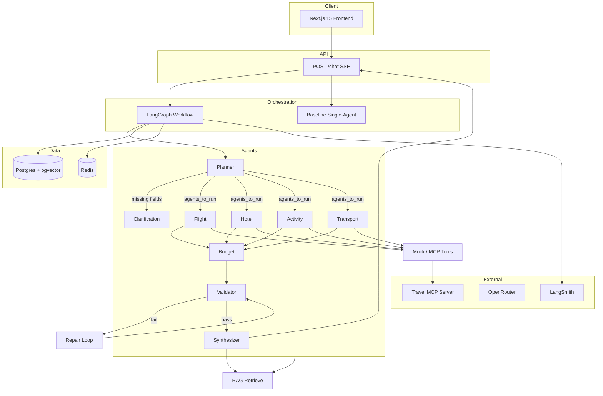

# TravelAI Architecture

TravelAI is a production-grade multi-agent travel planning system. M1 establishes the monorepo skeleton; M2–M5 fill in LangGraph, RAG, MCP, eval, and deployment without changing the final rubric layout.

## System Overview



## Design Decisions

### Planner conditional routing

1. **Planner** parses the user message into a `TravelBrief` (destination, duration, budget, dates, travelers, interests).
2. If **destination**, **budget**, or **duration** is missing → route to **clarification** (SSE `delta` + structured `needs_clarification`). **No specialist agents** run.
3. If all required fields are present → Planner sets `agents_to_run` (default: flight, hotel, activity, transport) and LangGraph **fans out in parallel** to selected specialists via conditional `Send`.
4. Specialists complete → **Budget** → **Validator** → on failure **repair loop** (max 2 rounds, M2+) → **Synthesizer**.

### Baseline vs optimized

| Mode | Module | Behavior |
|------|--------|----------|
| `baseline` | `app/graph/baseline.py` | Single agent, no RAG, no validator, no repair |
| `optimized` | `app/graph/workflow.py` | Full multi-agent, RAG, validator, repair |

Eval harness (`eval/run_eval.py`) runs both modes against `eval/golden.jsonl`.

### MCP

- Separate process: `python -m app.mcp.server` (`backend/app/mcp/server.py`).
- Tools: `search_hotels`, `search_activities`, `estimate_transport`, `get_destination_facts`.
- Business logic lives in `app/services/travel_tools.py`; MCP is a protocol wrapper only.

### RAG (primary knowledge — unchanged)

- Source: `datasets/destination_guides/*.md`
- Pipeline: chunk → embed → `documents` table (pgvector) → retrieve for Activity + Synthesizer.
- **Always runs first** on every activity/plan path.

### Web search (Tavily — supplementary)

- **Not a replacement for RAG.** Used only for live / timely queries (e.g. events, “latest”, or when RAG returns few chunks).
- Implemented in `app/services/tavily_search.py`; Activity agent calls it after RAG.
- Snippets stored in `AgentState.web_search_snippets` (separate from `rag_context`).
- Requires `TAVILY_API_KEY`; if missing or errors → skip silently, mock + RAG still work.

```
User message
    → RAG retrieve (guides + pgvector)     ← primary
    → Tavily search (optional)               ← web only
    → mock activities (costs / structure)    ← fallback
```

### Capstone 2.1 — selected components (4 of 6)

We intentionally use **four** components (Eval is separate in §2.2):

| Component | Role in TravelAI |
|-----------|------------------|
| **Multi-agent** | LangGraph orchestration, Planner routing, repair loop |
| **Tools** | Mock APIs + optional Tavily web search + graceful fallback |
| **RAG** | Destination guides → pgvector → Activity / Synthesizer |
| **MCP** | Standalone server exposing the same read-only tools |

**Not in scope:** persistent cross-session **Memory** (Mem0/Letta); dedicated **Security/Governance** stack (audit tables, policy engine). Tools return **estimates only** (no booking) as product behavior, not a sixth component.

### SSE contract

`POST /chat` returns `text/event-stream` with event types:

| Type | Purpose |
|------|---------|
| `trace` | Agent status / graph node |
| `delta` | Streaming text tokens |
| `card` | Structured partial (hotel, budget, activity) |
| `final` | Complete `TravelPlanResponse` |
| `error` | Graceful error payload |

### Cost control

- Cheap model: Planner, Validator (config).
- Strong model: Synthesizer only.
- `llm_usage_logs` per LLM call.
- Redis cache for tool + RAG results.
- Per-agent token limits in config.

### Observability

- LangSmith traces (when `LANGSMITH_API_KEY` set).
- `agent_runs` table per graph execution step.

## Repository Layout

```
travelai/
├── frontend/          # Next.js 15, Tailwind, shadcn/ui
├── backend/           # FastAPI, LangGraph, agents
├── datasets/          # destination guides + mock JSON
├── eval/              # golden.jsonl, judge, run_eval
├── tests/unit/        # pytest (8+ required tests)
├── docs/              # architecture, ADRs (future)
├── docker-compose.yml
└── README.md
```

## Milestones

### M1 (current)

- Monorepo structure, Docker (Postgres+pgvector, Redis, backend).
- Pydantic schemas, SQLAlchemy table placeholders.
- Mock datasets, eval/test placeholders, architecture + README.

### M2 — Intelligent core

- **LLM** (`app/services/llm_client.py`): **OpenRouter** (`LLM_PROVIDER=openrouter`, free `:free` models); rule-based fallback if API fails; Ollama optional.
- **Planner / Validator / Synthesizer** call LLM with structured JSON; rules + deterministic fallback if no key.
- **Cost tier**: cheap models for planner & validator; synthesizer uses stronger model config.
- Each call logs to `llm_usage_logs` when Postgres is up.
- RAG ingest + pgvector search; `agent_runs` per graph step.

### M3 — Periphery

- MCP server fully wired to `travel_tools`.
- Redis caching layer.
- LangSmith integration.
- Frontend chat UI consuming SSE.

### M4 — Evaluation

- 25+ golden cases, RAGAS metrics, dual-judge κ workflow.
- Baseline vs optimized experiment results in `eval/results/`.
- 8+ unit tests implemented (not placeholders).

### M5 — Deployment

- Vercel frontend, Render backend docs + env templates.
- E2E demo path documented in README.

## Database Tables (M1 placeholders)

| Table | Purpose |
|-------|---------|
| `agent_runs` | LangGraph step traces |
| `llm_usage_logs` | Per-call tokens and cost |
| `documents` | RAG chunks + embeddings |
